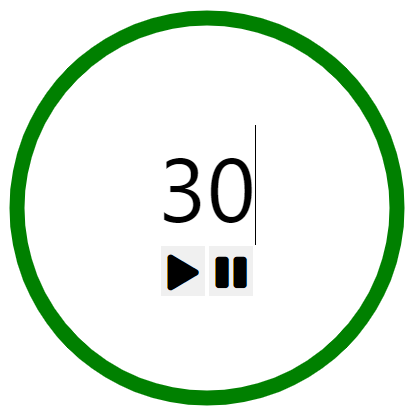
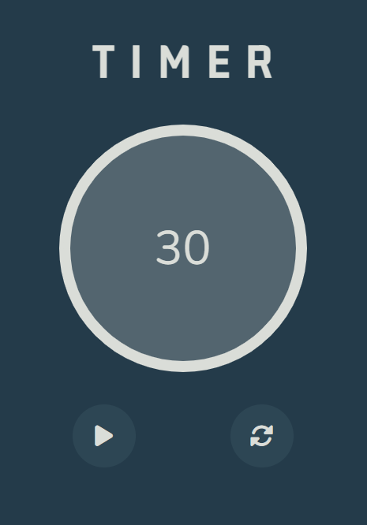

# 🕰 Timer Application.

### A project from a course I did, using native JavaScript. The goal of this project was learn about classes and how to make animations with SVG.

[Live Demo](https://tmsbenitez.github.io/timer-app/)

### 🕰 The final Timer App from the course:

When I finished the project I found some bugs.

The first bug was that when you press the start button many times it increases the speed.

The second bug was that when you pause the timer, the animation stops, but when you played it again, it restarts the animation from the beginning.

### 📋 My features:

The first feature was to add some styles to the project to make it look better.

The second was implement a restart button. Which when you click on it the duration value becomes equal to the initial value, and the animation restarts.

And the last one was add a sound when the timer is over.

#### Bug solving:

In order to resolve the first bug, I did that when you click on the start button it disappears and the pause button appears, so you can't use the start button again until you press the pause button.

And for the second bug, I searched from some help in internet and I resolved it replacing the start function to a resume function, so when you click on the start button, when the timer is already started, it resumes the animation with the last position of the stroke before you stop it.

## Authors and acknowledgment

The udemy course: [The Modern Javascript Bootcamp Course (2022)](https://www.udemy.com/course/javascript-beginners-complete-tutorial/) by Colt Steele and Stephen Grider.
